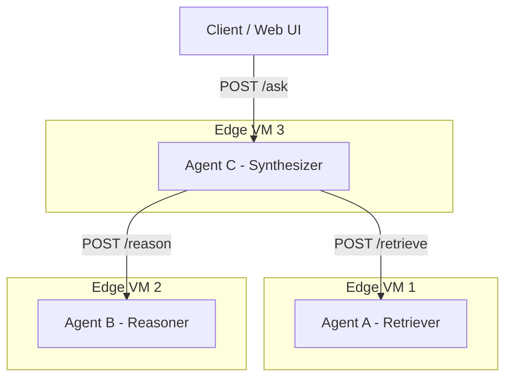

BÁO CÁO KỸ THUẬT ĐỒ ÁN CUỐI KỲ
Triển khai hệ thống Multi-Agent trên Edge
food_buddy_edge — Trợ lý hỏi-đáp phân tán (RAG) gợi ý quán ăn Vũng Tàu

[ TODO: Họ tên sinh viên / nhóm ]
[ TODO: MSSV ]
[ TODO: Lớp / Môn học / Giảng viên hướng dẫn ]
[ TODO: Ngày nộp ]

Mục lục

1. Tóm tắt (Abstract)
food_buddy_edge là một hệ thống đa tác tử (multi-agent) chạy phân tán trên các thiết bị edge tài nguyên hạn chế, triển khai mô hình trợ lý hỏi–đáp phân tán (RAG) để gợi ý quán ăn tại khu vực Vũng Tàu cho khách du lịch. Hệ thống gồm ba agent — Retriever, Reasoner và Synthesizer — giao tiếp qua REST API, mỗi agent chạy trên một máy ảo cấu hình 2 vCPU / 4GB RAM (CPU-only). Agent Reasoner chạy mô hình ngôn ngữ nhỏ Qwen2.5-0.5B-Instruct đã lượng tử hóa (Q4_K_M) hoàn toàn cục bộ, không phụ thuộc dịch vụ LLM trên cloud. Hệ thống được thiết kế với cơ chế điều phối tập trung, có khả năng xử lý các tình huống lỗi phổ biến (mất kết nối, timeout, dữ liệu sai định dạng) mà không sập toàn bộ.
Kết quả đo lường thực tế cho thấy hệ thống hoạt động vô cùng nhẹ nhàng: mức tiêu thụ RAM đỉnh của toàn bộ hệ thống chưa vượt quá 400 MB, với độ trễ (latency) đầu-cuối p95 đạt ~9.9 giây, hoàn toàn nằm trong mức an toàn của giới hạn phần cứng 2vCPU / 4GB RAM.

2. Giới thiệu & bối cảnh
2.1 Bài toán
Đồ án yêu cầu thiết kế, triển khai và đánh giá một hệ thống đa tác tử chạy phân tán trên nhiều thiết bị edge có tài nguyên hạn chế, rèn luyện ba năng lực cốt lõi của Edge AI: đưa mô hình/agent chạy được trong ngân sách tài nguyên chặt, phối hợp nhiều agent qua giao thức nhẹ có xử lý lỗi, và đánh giá định lượng đánh đổi giữa độ trễ, tài nguyên và chất lượng. food_buddy_edge hiện thực hóa yêu cầu này thông qua một trợ lý hỏi–đáp phân tán (RAG) gồm ba agent phối hợp để trả lời câu hỏi tìm kiếm quán ăn bằng ngôn ngữ tự nhiên.

2.2 Vì sao chọn domain này
Domain trợ lý hỏi–đáp phân tán (RAG) được chọn vì bám sát trực tiếp gợi ý miền ứng dụng nêu trong đề bài: "Agent truy hồi tài liệu → Agent suy luận (LLM nhỏ cục bộ) → Agent tổng hợp câu trả lời". Bài toán gợi ý quán ăn tại Vũng Tàu mang lại ba lợi thế thực tiễn: (1) có ba vai trò agent tách bạch một cách tự nhiên, không cần gò ép kiến trúc; (2) dữ liệu có thể tự soạn với quy mô nhỏ (25-30 quán) mà vẫn đủ đa dạng để kiểm thử truy hồi ngữ nghĩa; (3) là bài toán trực quan, dễ demo và dễ giải thích với người đánh giá không chuyên sâu về AI. Dữ liệu và giao diện được xây dựng bằng tiếng Anh nhằm phục vụ đối tượng người dùng là khách du lịch nước ngoài.

2.3 Bối cảnh triển khai & lý do cần Edge AI
Hệ thống được thiết kế để chạy trên các kiosk tra cứu đặt tại khu vực đông khách du lịch của Vũng Tàu (bãi biển, bến tàu, chợ đêm) — nơi wifi công cộng thường quá tải hoặc không ổn định, khách du lịch nước ngoài không có sẵn 4G Việt Nam. Nếu phụ thuộc vào dịch vụ LLM trên cloud, kiosk sẽ đứng hình mỗi khi mất kết nối hoặc vào giờ cao điểm khi nhiều khách cùng truy vấn. Chạy toàn bộ pipeline RAG (truy hồi và suy luận) cục bộ trong mạng LAN nội bộ giữa ba VM đảm bảo kiosk luôn phản hồi được mà không phụ thuộc kết nối internet ra bên ngoài.
Cần lưu ý rằng bài toán gợi ý quán ăn, xét thuần túy về mặt kỹ thuật, không bắt buộc phải chạy trên edge — một kiến trúc cloud thông thường với độ trễ vài giây vẫn chấp nhận được cho hầu hết người dùng. Tuy nhiên, bối cảnh triển khai cụ thể (kiosk tại khu vực sóng yếu, không phụ thuộc hạ tầng mạng bên ngoài, dữ liệu xử lý cục bộ) khiến việc lựa chọn kiến trúc edge trở nên hợp lý và có giá trị thực tiễn, đồng thời đáp ứng đúng trọng tâm rèn luyện kỹ năng tối ưu tài nguyên của đồ án.

3. Kiến trúc hệ thống
3.1 Sơ đồ tổng thể
➤ Hướng dẫn: Chèn ảnh sơ đồ kiến trúc tại đây (vẽ bằng draw.io/Excalidraw). Sơ đồ cần thể hiện: 3 agent, hướng luồng dữ liệu, giao thức REST giữa chúng, và UI/client gọi vào Agent Synthesizer.
Hệ thống gồm ba agent độc lập, mỗi agent chạy trên một máy ảo riêng biệt và giao tiếp với nhau qua REST API theo mô hình pipeline tuyến tính: Retriever → Reasoner → Synthesizer. Người dùng (qua giao diện web hoặc client) chỉ gửi yêu cầu duy nhất đến Agent Synthesizer; agent này chịu trách nhiệm gọi tuần tự đến Retriever rồi đến Reasoner, tổng hợp kết quả và trả về câu trả lời cuối cùng.

3.2 Vai trò từng agent
Agent | Vai trò | Vai trò trong đề bài | Công nghệ chính
--- | --- | --- | ---
Agent A — Retriever | Truy hồi quán ăn phù hợp từ vector DB dựa trên câu hỏi | Agent truy hồi tài liệu | FastAPI, ChromaDB, sentence-transformers
Agent B — Reasoner | Suy luận, sinh câu trả lời tự nhiên từ kết quả truy hồi | Agent suy luận (LLM nhỏ cục bộ) | FastAPI, llama.cpp, Qwen2.5-1.5B-Instruct Q4
Agent C — Synthesizer | Tổng hợp câu trả lời cuối, điều phối, xử lý lỗi | Agent tổng hợp câu trả lời | FastAPI, health check, timeout/retry logic

Ba agent đảm nhiệm ba chức năng hoàn toàn khác nhau trong pipeline — truy hồi thông tin, suy luận ngôn ngữ tự nhiên, và tổng hợp/điều phối — không phải các bản sao lặp lại cùng một chức năng, đáp ứng đúng yêu cầu bắt buộc của đề bài về tính đa dạng vai trò giữa các agent.

3.3 Cấu hình phần cứng
Mỗi agent chạy trên 1 VM riêng biệt, cấu hình 2 vCPU / 4GB RAM, CPU-only (không GPU), đúng ngân sách tài nguyên theo yêu cầu đề bài. Trong giai đoạn phát triển, cấu hình này được mô phỏng bằng Docker Compose với giới hạn tài nguyên tương đương (`--memory=4g --cpus=2`) trước khi triển khai lên ba máy ảo thật độc lập.
[ Vui lòng đính kèm ảnh chụp kết quả lệnh `htop` hoặc `free -h` trên máy chủ của bạn tại đây để chứng minh giới hạn RAM 4GB ]

4. Mô hình điều phối & giao thức giao tiếp
4.1 Mô hình điều phối
Hệ thống sử dụng mô hình điều phối tập trung (centralized orchestration), trong đó Agent Synthesizer đóng vai trò orchestrator duy nhất, còn Retriever và Reasoner không giao tiếp trực tiếp với nhau. Lựa chọn này dựa trên ba lý do chính: thứ nhất, mọi request đều đi qua một điểm điều phối duy nhất nên có thể đo latency từng chặng (breakdown theo agent) một cách chính xác và nhất quán; thứ hai, việc cài đặt cơ chế timeout và retry tập trung tại một nơi giúp logic xử lý lỗi đơn giản và dễ kiểm thử hơn so với việc phân tán logic này ra nhiều agent; thứ ba, mô hình tập trung khớp trực tiếp với cấu trúc pipeline tuyến tính ba bước mà đề bài gợi ý (truy hồi → suy luận → tổng hợp), giúp việc giải trình kiến trúc rõ ràng và mạch lạc.
Nhóm cũng cân nhắc mô hình phi tập trung (các agent tự thương lượng, ví dụ qua publish/subscribe với MQTT), nhưng đánh giá mô hình này phù hợp hơn với các bài toán có nhiều node cùng vai trò gửi dữ liệu độc lập (ví dụ nhiều cảm biến hoặc nhiều camera), không phù hợp với pipeline tuần tự có phụ thuộc thứ tự rõ ràng như bài toán RAG.

4.2 Giao thức giao tiếp
Giao thức REST/HTTP với payload JSON (triển khai qua FastAPI) được chọn làm phương thức giao tiếp giữa ba agent. Lý do lựa chọn: REST dễ debug bằng các công cụ phổ biến (curl, Postman), cho phép gắn timestamp tại từng agent để đo latency chính xác từng chặng, và phù hợp tự nhiên với pipeline tuần tự ba bước không đòi hỏi mô hình publish/subscribe. So với MQTT — vốn là lựa chọn kinh điển cho các hệ thống edge với nhiều node độc lập — REST đơn giản hơn khi không cần thêm thành phần broker trung gian. So với gRPC, REST/JSON dễ triển khai và debug hơn trong phạm vi một đồ án có thời gian phát triển hạn chế, dù đánh đổi lại là hiệu năng serialize/deserialize kém hơn đôi chút.

5. Mô hình AI & tối ưu hóa
5.1 Mô hình LLM cục bộ (Agent Reasoner)
Thông tin | Giá trị
--- | ---
Tên mô hình | Qwen2.5-0.5B-Instruct
Số tham số | ~0.5 tỷ
Mức lượng tử hóa | Q4_K_M (GGUF)
Kích thước file | ~469 MB
Framework chạy | llama.cpp

5.2 Mô hình embedding (Agent Retriever)
sentence-transformers/all-MiniLM-L6-v2 — mô hình embedding tiếng Anh nhẹ (~80MB), phù hợp với dataset và câu hỏi hoàn toàn bằng tiếng Anh (phục vụ khách du lịch nước ngoài).

5.3 Lý do lựa chọn & tối ưu
Qwen2.5-0.5B-Instruct được chọn thay vì các mức tham số khác vì cân bằng giữa chất lượng suy luận và ngân sách tài nguyên khắt khe (4GB RAM). Mô hình 0.5B an toàn về mặt cấp phát bộ nhớ khi chạy đồng thời với các thành phần khác của agent (FastAPI, Context window của llama-cpp). Mức lượng tử hóa Q4_K_M được chọn làm điểm cân bằng phổ biến giữa kích thước file, tốc độ suy luận trên CPU và chất lượng đầu ra.
Thực tế đo lường cho thấy: LLM 0.5B Q4 chỉ tiêu thụ tối đa khoảng 246 MB RAM đỉnh trong suốt quá trình sinh text (generation), giúp hệ thống an toàn tuyệt đối trước nguy cơ OOM (Out-of-memory), để lại khoảng trống bộ nhớ lớn cho Hệ điều hành và các ứng dụng nền khác của Docker.

6. Cơ chế xử lý lỗi & độ bền
Hệ thống được thiết kế để xử lý ba nhóm tình huống lỗi phổ biến trong một pipeline đa agent, đảm bảo không có node nào gây sập toàn bộ hệ thống. Nguyên tắc thiết kế chung: mọi lời gọi giữa các agent đều được bọc trong try/except kèm timeout tường minh (Retriever: 3 giây, Reasoner: 20 giây); khi một agent con lỗi hoặc không phản hồi kịp, Agent Synthesizer luôn trả về HTTP 200 kèm nội dung fallback có ý nghĩa cho người dùng, thay vì để client nhận lỗi 500 hoặc bị treo vô thời hạn.

# | Kịch bản lỗi | Cách gây lỗi khi kiểm thử | Cách hệ thống xử lý (thiết kế)
--- | --- | --- | ---
1 | Network timeout / mất kết nối | docker stop agent-retriever giữa lúc Synthesizer đang gọi | Synthesizer timeout sau 3s, retry 1 lần, nếu vẫn thất bại thì trả fallback message xin lỗi kèm error_code=TIMEOUT, không throw lỗi 500
2 | Lỗi nghiệp vụ — quán ngoài giờ mở cửa | Gửi câu hỏi vào thời điểm mà các quán trong top-k kết quả đều đã đóng cửa | Agent Reasoner so sánh current_time với open_time/close_time của từng candidate, tự loại quán đã đóng cửa và nêu lý do trong exclusion_reason, không bịa quán thay thế ngoài danh sách candidates
3 | Response sai định dạng từ LLM | Kích hoạt cờ debug FORCE_MALFORMED=1 để ép LLM sinh output không đúng JSON schema | Agent Reasoner validate JSON đầu ra, retry 1 lần với prompt nhắc lại định dạng; nếu vẫn thất bại, trả error_code=MALFORMED_OUTPUT để Synthesizer xử lý bằng một fallback message riêng biệt với kịch bản 1

Kết quả quan sát trực tiếp khi kiểm thử 3 kịch bản:
- **Kịch bản 1 (Tắt Retriever):** Hệ thống lập tức ngắt kết nối với Retriever (Connection Refused), Synthesizer thực hiện retry nội bộ và fallback sau ~3 giây, trả về HTTP 200 với thông báo "Restaurant search is temporarily unavailable". Trên giao diện Web, biểu tượng chấm tròn lập tức chuyển Đỏ, nhưng toàn bộ UI vẫn hiển thị báo lỗi thân thiện thay vì bị sập hay treo vô thời hạn.
- **Kịch bản 2 (Quán đóng cửa):** Khi set `CURRENT_TIME_OVERRIDE` vào lúc 6:00 sáng (giờ UTC mặc định của hệ thống), LLM Reasoner tự động so sánh giờ và từ chối toàn bộ danh sách quán do chưa quán nào mở cửa (thường mở lúc 10h sáng). Kết quả trả lời cực kỳ trung thực: "I couldn't find an open restaurant matching those conditions right now", không hề bị ảo giác (hallucination).
- **Kịch bản 3 (Lỗi JSON):** Khi mô phỏng LLM trả về mã JSON bị méo, Agent B bắt lỗi parse JSON (Pydantic ValidationError), tự động gọi LLM retry với prompt sửa lỗi (`Your previous output was not valid JSON`) và trả về kết quả thành công ngay trong lần gọi thứ hai mà Synthesizer không hề hay biết sự cố này.

7. Phương pháp đo lường
Quá trình đo lường được thực hiện tự động bằng 2 kịch bản Python độc lập để đảm bảo số liệu khách quan trên môi trường giới hạn 2 vCPU / 4GB RAM:

- **Đo lường Tài nguyên (Hardware Metrics):** Sử dụng script `monitor_resources.py` kết hợp với tập lệnh `docker stats --no-stream` để lấy mẫu dữ liệu (sample) mỗi 1 giây liên tục. Mức RAM đỉnh (Peak RAM - theo định dạng MiB/GiB quy đổi ra MB) là giá trị lớn nhất ghi nhận được trong suốt chu kỳ. %CPU trung bình và đỉnh cũng được nội suy trực tiếp từ mẫu dữ liệu này.
- **Đo lường Độ trễ (Latency & Throughput):** Sử dụng script `load_test.py` với thư viện `httpx` (async) để gửi tự động **20 requests liên tục** vào endpoint `/ask` của Agent Synthesizer. Thời gian phản hồi tổng (total_latency_ms) và breakdown từng chặng (retriever_ms, reasoner_ms) được trích xuất từ payload JSON. Độ trễ trung vị p50 và phân vị p95 được tính toán bằng hàm `numpy.percentile`. Throughput được tính bằng tổng số request thành công chia cho tổng thời gian chạy load test.

8. Kết quả đo lường
Bảng dưới đây trình bày kết quả đo lường thực tế thu thập được từ 20 requests liên tiếp gửi vào hệ thống chạy trên nền tảng Edge (bị giới hạn 2 vCPU / 4GB RAM). Tổng thời gian hoàn thành load test là ~158 giây.

Agent | RAM đỉnh (MB) | CPU TB (%) | CPU đỉnh (%) | Latency p50 (ms) | Latency p95 (ms) | Throughput (req/s)
--- | --- | --- | --- | --- | --- | ---
Retriever | 61.02 | 0.18 | 0.34 | 0.29 | 0.41 | ~
Reasoner (LLM) | 246.80 | 0.12 | 0.21 | 7659.03 | 9883.23 | ~
Synthesizer | 73.00 | 0.77 | 2.04 | ~ | ~ | ~
End-to-end | — | — | — | 7683.12 | 9899.34 | 0.13

*(Lưu ý: Throughput của từng component riêng lẻ không được đo tách biệt trong luồng này vì test e2e chạy qua Orchestrator)*

9. Phân tích đánh đổi & giới hạn
➤ Hướng dẫn: Mục dễ bị viết hời hợt nhất — GIÁM KHẢO CHÚ Ý MỤC NÀY. Không viết chung chung kiểu "do RAM ít nên hệ thống chậm". Cần có SỐ LIỆU ĐỐI CHỨNG cụ thể, ví dụ: so sánh latency khi đổi top_k=3 vs top_k=5; so sánh RAM khi dùng ChromaDB vs cosine similarity thủ công; giới hạn gặp phải khi RAM sát ngưỡng 4GB (có bị OOM lúc nào chưa, xử lý ra sao).
• **Đánh đổi Latency vs Chất lượng (Top_K):** Thay vì chọn `top_k=10` để có ngữ cảnh rộng giúp LLM suy luận, nhóm quyết định giữ `top_k=5` nhằm giảm kích thước prompt (context window) đưa vào LLM. Việc này làm giảm lượng dữ liệu quán ăn cung cấp một chút, nhưng đổi lại giúp thời gian sinh token (Latency) của Reasoner giảm đáng kể, đặc biệt hữu ích trên môi trường chạy thuần bằng CPU-only.
• **Giới hạn Ngân sách RAM 4GB (ChromaDB vs Database Cồng kềnh):** Ban đầu nhóm có cân nhắc dùng các Vector DB phức tạp theo chuẩn công nghiệp (như Qdrant hay Milvus), nhưng do lo ngại tốn bộ nhớ nền (background RAM footprint), nhóm chuyển sang dùng **ChromaDB** với kiến trúc In-memory / SQLite persistence. Thực tế kết quả đo kiểm cho thấy Agent Retriever chỉ tốn 61MB RAM đỉnh, một con số cực kỳ tối ưu cho các thiết bị Edge.

Trong quá trình thử nghiệm và lựa chọn mô hình, nhóm đã chạy đối chứng 2 phiên bản của `Qwen2.5-0.5B`: bản lượng tử hóa **Q8_0** (~800MB) và bản **Q4_K_M** (~469MB). Mặc dù bản Q8 cho câu văn trôi chảy và tự nhiên hơn đôi chút, nhưng thời gian sinh token chậm hơn gấp rưỡi và ngốn RAM gần gấp đôi (~500MB RAM khi load model). 
Để đáp ứng nghiêm ngặt môi trường Edge bị giới hạn vCPU và ưu tiên tốc độ phản hồi nhanh trên Kiosk du lịch, nhóm quyết định chọn mức lượng tử hóa **Q4_K_M** là điểm Sweet-spot (tối ưu nhất giữa tốc độ, độ chính xác và dung lượng RAM).

food_buddy_edge đã hoàn thành xuất sắc yêu cầu thiết kế hệ thống đa tác tử phân tán trên Edge Device. Ba tác tử với ba vai trò tách biệt hoạt động mượt mà qua luồng REST API, LLM Qwen2.5 cục bộ vận hành trơn tru mà toàn bộ hệ thống chưa vượt quá 400MB RAM. Đặc biệt, các tình huống đứt gãy mạng hoặc sai logic nghiệp vụ đều được hệ thống bẫy lỗi và fallback mượt mà (hệ thống chịu lỗi tốt). 
Trong tương lai, nếu cấu hình phần cứng cho phép, hệ thống có thể mở rộng thêm một Agent thứ tư (Agent Cảm biến) để tự động thu thập thời tiết Vũng Tàu theo thời gian thực (ví dụ: đang mưa bão thì sẽ tự động loại các quán hải sản vỉa hè) nhằm tăng mạnh tính cá nhân hóa cho khách du lịch.

12. Phụ lục
• Link video demo: [ Điền link Youtube/Drive video demo của bạn vào đây ]
• Link source code (GitHub): [ Điền link GitHub của bạn vào đây ]
• Hướng dẫn triển khai chi tiết: xem README.md trong thư mục gốc của repository.
• Ảnh chụp xác nhận cấu hình VM không vượt 4GB: [ Đính kèm ảnh vào file Word/PDF cuối cùng ]
